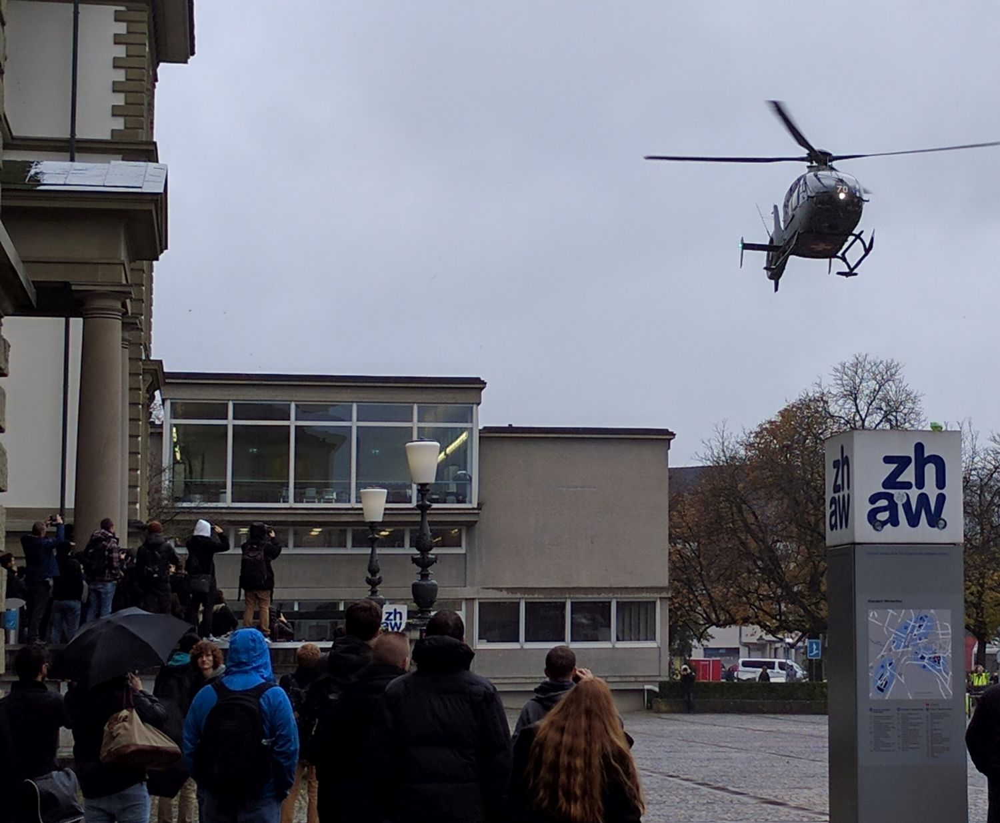
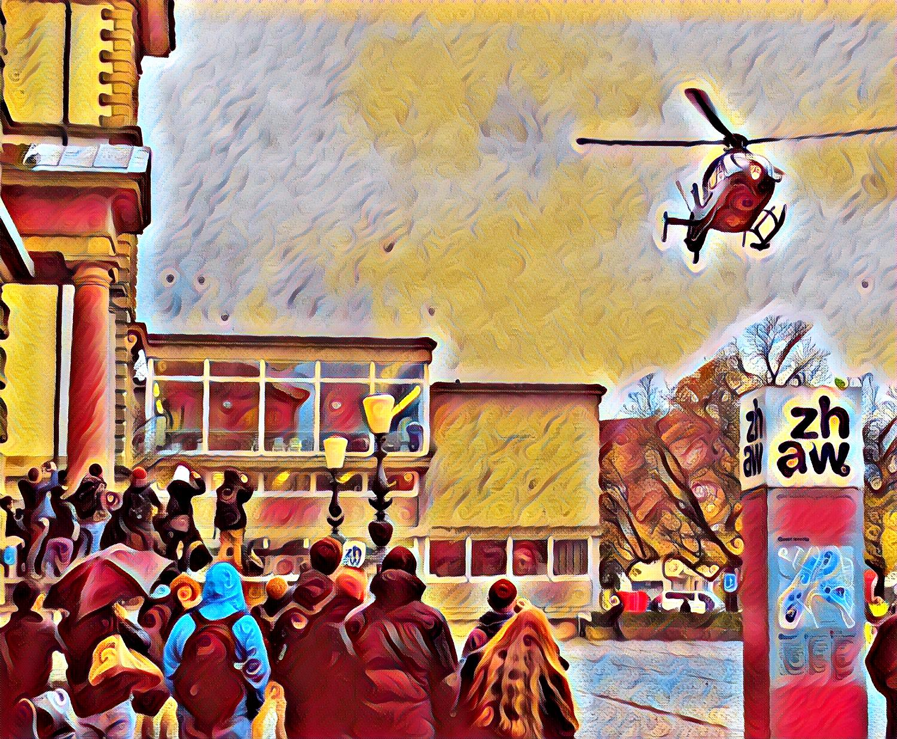
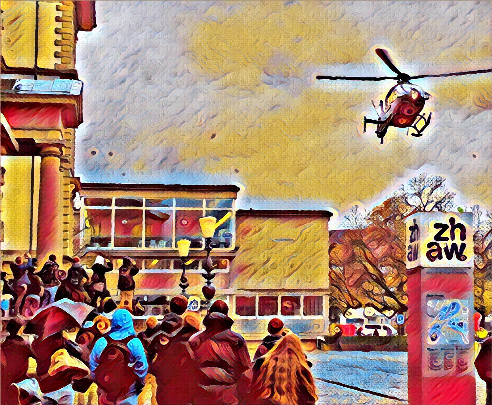

# TensorFlow implementation of DmitryUlyanov/texture_nets

This is a TensorFlow implementation of the stylization part of [texture_nets](https://github.com/DmitryUlyanov/texture_nets) from Ulyanov. We used the pretrained model, which is provided by Ulyanov (it is not the same as the model described in the paper). The download link can be found within their repository.

With this implementation one can achieve the same stylization results as with the original Torch implementation and the provided weights.

The purpose of this repository is to explain the process of porting an existing Torch model with pretrained weights to an independent TensorFlow implementation.

## Results

The TensorFlow implementation is not completely identical. The slight differences between the output pictures below can be seen, if compared properly.

On the left-hand side the input-picture is shown. The second picture is generated with the original Torch implementation and the third picture is generated with our TensorFlow implementation.

  

## Prerequisites

* [TensorFlow](https://www.tensorflow.org/) (>= r1.0)
* [Scipy](https://www.scipy.org/)
* [Numpy](http://www.numpy.org/)
* [Pillow](https://python-pillow.org/)

Optional, only needed for [stylize_torch_weights.py](./stylize_torch_weights.py):

* [Torch](https://torch.ch)
* [Lutorpy](https://github.com/imodpasteur/lutorpy)
* Pretrained model, available at [texture_nets](https://github.com/DmitryUlyanov/texture_nets) (save it to folder `./model/`)

## Usage

In order to stylize a picture, run:

```sh
python stylize_tensorflow.py --input path/to/input/picture --output path/to/output/picture
```

All three files (`stylize_tensorflow.py`, `stylize_tensorflow_graph.py` and `stylize_torch_weights.py`) can be used interchangeably. See later explanation to learn more about their differences.


## Motivation

During our project thesis, the aim was to prepare an artstyle-transfer neural network for a later usage in a smartphone app. [texture_nets](https://github.com/DmitryUlyanov/texture_nets) was the ideal foundation, due to the performance improvements of Ulyanov et al. with the instance normalization and the provided pretrained model.

We ported the stylization part to TensorFlow. In order to avoid training of the network, we used the weights of the provided model and imported them directly into the TensorFlow network.

With this repository we aim to explain and show the steps we have taken and the insights we have gained.

## Files

* [stylize_torch_weights.py](./stylize_torch_weights.py)

    This script shows our first-step, which consists of the complete network implemented with TensorFlow but loading all weights directly from the original Torch model file with _Lutorpy_. At the end of the script the graph and the weights are saved to a TensorFlow file. These files are the basis of the other two scripts.

* [stylize_tensorflow.py](./stylize_tensorflow.py)

    Independent implementation in Tensorflow. The weights are loaded from the previous saved TensorFlow files. The implementation has no dependency left on the original Torch model file. From this state one can continue and do further development.

* [stylize_tensorflow_graph.py](./stylize_tensorflow_graph.py)

    Another independent implementation in TensorFlow. The graph is also loaded from the saved TensorFlow files.


## Procedure

The procedure of porting the neural network from Torch to TensorFlow can be roughly described with the following three steps:

1. Translate network architecture to TensorFlow (see table with layer matching)
2. Import of the weights
3. Save graph and weights with TensorFlow

**General Remarks:** It is crucial for the result to represent the content-image in the correct format. The Torch implementation uses color values from the range of 0 to 1 and is trained with such values. Therefore we represent the content-image in our implementation in the same way.

If one would like to use this implementation for training, several changes are necessary:

* A descriptor network is required.
* The weight initialization has to be according to the original implementation.
* Correct implementation of the Instance Normalization, see below.

### Layers

Most of the layer have an equivalent in TensorFlow. Please refer to the file [analyze_model.lua](./analyze_model.lua), to see how the model has been analysed.

Torch | TensorFLow | Remarks
--- | --- | ---
nn.ReLU | tf.nn.relu | -
nn.SpatialConvolution | tf.nn.conv2d |  Use `padding='VALID'`, the strides have the format `[1, height, width, 1]`
nn.SpatialFullConvolution | tf.nn.conv2d_transpose | Use `padding='VALID'`, calculate the parameter `output_shape` dynamically (see remark below)
nn.CAddTable | tf.add\_n | -

**Remark:** The transpose convolutional layers restore the original shape of the tensor. One transpose convolutional layer reverses the changes at the shape of the corresponding convolutional layer (with strides greater than 1 x 1). Therefore the `output_shape` is identical with the shape of the tensor right before the convolutional layer (see function `conv_transponse` in [stylize_tensorflow.py](./stylize_tensorflow.py) for an example).

The padding layers and the instance normalization layer do not have a direct equivalent in TensorFlow.

#### Padding

The padding mode _replication_ is not available in TensorFlow. But one can use the _symmetric_ padding multiple times.

Torch:
```lua
nn.SpatialReplicationPadding(4, 4, 4, 4)
```

TensorFlow:
```python
paddings = [[0, 0], [1, 1], [1, 1], [0, 0]]
pad = tf.pad(input_tensor, paddings, "SYMMETRIC")
pad = tf.pad(pad, paddings, "SYMMETRIC")
pad = tf.pad(pad, paddings, "SYMMETRIC")
pad = tf.pad(pad, paddings, "SYMMETRIC")
```

#### Instance Normalization

The instance normalization is identical with the batch normalization, if the batch size is equal to 1. Therefore the instance normalization can be achieved with following code:
```python
scale = tf.Variable(..., name='scale')
offset = tf.Variable(..., name='offset')
epsilon = 1e-5
mean, var = tf.nn.moments(input_tensor, [1, 2], keep_dims=True)
norm = tf.nn.batch_normalization(input_tensor, mean, var, offset, scale, epsilon)
```

**Remark:** This will not work if one will use this implementation to train the network. As soon as the batch size is greater than 1, one has to implement the correct instance normalization according to [Instance Normalization: The Missing Ingredient for Fast Stylization](https://arxiv.org/abs/1607.08022) of Ulaynov et al.

### Import

To import the weights from the Torch model, one can use the Python library `lutorpy`.

```python
import lutorpy as lua

# Import of the Lua and Torch modules
require("torch")
require("nn")
require("lua_modules/TVLoss")
require("lua_modules/InstanceNormalization")

# Loading of the pretrained model
torch_model = torch.load('./data/model.t7')

# Accessing the weights
weights = np.transpose(torch_model.modules[2].weight.asNumpyArray())
```

#### Remarks

* Lua uses indices starting with one, depending on the configuration of _Lutorpy_. This might be considered carefully when trying to access the weights.
* Torch uses a different format for tensors, therefore a transpose is necessary.
* If the model contains layers which are not part of the standard torch library, as it is the case with instance normalization, the relevant modules have to be imported.

### Save
Once the network is completely set up, the weights can be saved as a TensorFlow file. Afterwards, the Torch model and the import with _Lutropy_ is unnecessary. See file [stylize_tensorflow_graph.py](./stylize_tensorflow_graph.py) and [stylize_tensorflow.py](./stylize_tensorflow.py).
